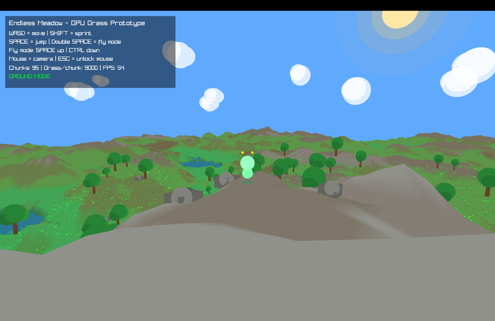
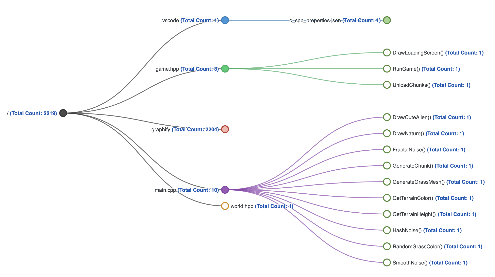

<p align="center">
  
</p>

<h1 align="center">Endless Meadow 🌿</h1>

<p align="center">
  A cinematic procedural meadow prototype built in modern C++.
</p>

<p align="center">
  
  
  
</p>

---




A cinematic procedural meadow prototype built in **modern C++**, powered by **raylib**, procedural terrain generation and GPU-animated grass rendering.

Endless Meadow creates an infinite stylized open world featuring dynamic terrain, animated vegetation, atmospheric lighting and real-time chunk streaming.

---

# Architecture Graph



The project architecture is separated into:

- `main.cpp` → application entry point
- `game.hpp` → gameplay loop, rendering pipeline, camera system
- `world.hpp` → procedural terrain generation, chunk system, grass rendering, environment simulation

---

# Features

- 🌱 GPU animated grass shader
- ⛰️ Infinite procedural terrain generation
- 🌊 Dynamic water rendering
- 🌲 Procedural trees and rocks
- 👾 Animated alien character
- 🎥 Cinematic free camera system
- ☀️ Atmospheric lighting
- ⚡ Chunk streaming & world loading
- 🧠 Noise-based terrain synthesis
- 🖥️ Built with modern C++ and raylib

---

# Technologies

- C++
- raylib
- OpenGL
- GLSL shaders
- CMake
- Procedural generation
- Fractal noise synthesis

---

# Project Structure

```txt
EndlessMeadow/
├── main.cpp
├── game.hpp
├── world.hpp
├── meadow.png
├── graph-tree.png
├── CMakeLists.txt
├── README.md
├── LICENSE.md
└── build/
````

---

# Rendering Pipeline

The engine uses:

* procedural mesh generation
* GPU-instanced grass rendering
* custom GLSL grass shaders
* chunk-based terrain streaming
* fractal noise terrain synthesis
* real-time environment rendering

The terrain is generated dynamically using layered fractal noise functions and ridge noise shaping to simulate natural hills, mountains and meadow formations.

---

# Terrain System

The world generation system includes:

* infinite chunk streaming
* heightmap synthesis
* terrain color blending
* dynamic grass distribution
* environmental object spawning
* procedural rock and tree placement

Each chunk is generated independently and streamed around the player position in real time.

---

# Grass Rendering

The grass system uses:

* GPU vertex animation
* wind simulation
* procedural blade placement
* dynamic color variation
* shader-based movement

Grass blades are generated procedurally and animated entirely on the GPU for performance efficiency.

---

# Water System

The water layer is rendered dynamically around the player using:

* animated water movement
* large-scale plane rendering
* atmospheric color blending
* procedural world integration

---

# Installation

## macOS

### Install dependencies

```bash
brew install raylib cmake
```

---

## Clone repository

```bash
git clone https://github.com/Armin-000/EndlessMeadow.git
cd EndlessMeadow
```

---

## Build project

```bash
mkdir build
cd build

cmake ..
cmake --build .
```

---

## Run

```bash
./EndlessMeadow
```

---

# Controls

| Key     | Action        |
| ------- | ------------- |
| W A S D | Move          |
| Mouse   | Rotate camera |
| Space   | Jump          |
| ESC     | Exit          |

---

# Procedural Generation

The project uses multiple procedural generation techniques:

* layered fractal noise
* ridge noise terrain shaping
* chunk-based world streaming
* procedural vegetation placement
* randomized environmental variation

This allows the world to generate infinitely without storing massive map data.

---

# Performance

The engine includes:

* chunk visibility optimization
* procedural asset generation
* GPU-based grass animation
* distance-based rendering
* optimized terrain mesh generation

---

# Project Purpose

This project was created as:

* a graphics programming experiment
* a procedural rendering showcase
* a terrain generation prototype
* a GPU grass rendering demonstration
* a personal portfolio project

---

# Future Improvements

Planned upgrades include:

* realistic sky rendering
* volumetric fog
* physically-based lighting
* improved terrain erosion
* advanced water shaders
* biome generation
* weather simulation
* real-time shadows

---

# License

This project is intended for:

* learning
* experimentation
* graphics research
* portfolio demonstration

Commercial redistribution and resale are prohibited.

See `LICENSE.md` for additional information.