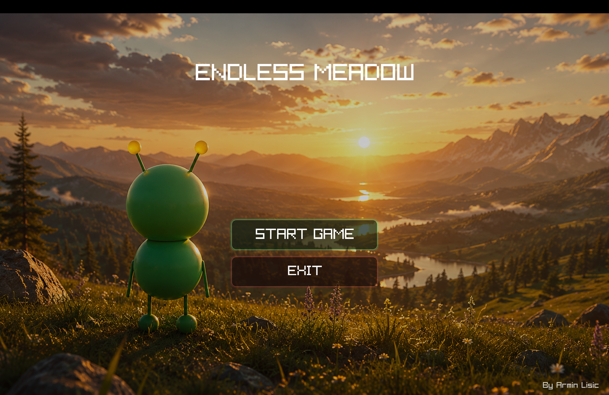

<p align="center">
  
</p>

<h1 align="center">Endless Meadow 🌿</h1>

<p align="center">
  A cinematic procedural meadow prototype and experimental mini-engine built in modern C++ using raylib and OpenGL.
</p>

<p align="center">
  
  
  
  
  
</p>

<p align="center">
  
</p>

---


---

# Endless Meadow

Endless Meadow is a cinematic procedural meadow sandbox and experimental mini-engine focused on procedural rendering, atmospheric visuals and modular gameplay systems.

Built using:
- C++17
- raylib
- OpenGL
- GLSL
- CMake

The project combines:
- procedural terrain generation
- real-time chunk streaming
- stylized rendering
- cinematic exploration
- lightweight engine architecture

---

# Features

- 🌱 Infinite procedural terrain
- 🌊 Animated water shader
- ☁️ Atmospheric cloud rendering
- 🌲 Procedural trees and rocks
- 🌸 GPU grass & flower rendering
- 👾 Procedural animated alien
- 🧠 Reactive alien antenna physics
- 🎒 Cinematic procedural backpack
- 🪵 Tree destruction system
- 📦 Wood drop physics
- ✨ Magnetic item pickup
- 🗺️ Real-time terrain minimap
- 🎮 Runtime chunk streaming
- 🎒 Backpack inventory UI
- ✨ Pickup popup effects
- 🛫 Fly mode
- 🎬 Cinematic preload system
- 🧩 Modular `.hpp/.cpp` architecture

---

# Controls

| Key | Action |
|------|--------|
| W A S D | Move |
| Mouse | Camera |
| SHIFT | Sprint |
| SPACE | Jump |
| Double SPACE | Fly Mode |
| CTRL | Fly Down |
| E | Backpack |
| M | Map |
| Left Click | Hit Tree |
| ESC | Pause |
| Q | Replay Preload |

---

# Project Structure

```txt
include/
├── game.hpp
├── preload.hpp
├── world.hpp
├── world_types.hpp
├── terrain.hpp
├── vegetation.hpp
├── water.hpp
├── sky.hpp
├── alien.hpp
├── collisions.hpp
├── map.hpp
├── inventory.hpp
└── item_drops.hpp

src/
├── main.cpp
├── game.cpp
├── preload.cpp
├── world.cpp
├── terrain.cpp
├── vegetation.cpp
├── water.cpp
├── sky.cpp
├── alien.cpp
├── collisions.cpp
├── map.cpp
├── inventory.cpp
└── item_drops.cpp
```

---

# Current Systems

## Terrain System
- Infinite procedural terrain
- Fractal & ridge noise generation
- Runtime chunk generation
- Terrain-aware rendering

## Vegetation System
- GPU grass rendering
- Flower rendering
- Procedural trees
- Procedural rocks
- Tree shaking animation

## Water System
- Animated GLSL water shader
- Dynamic wave movement
- Water rendering around player

## Alien System
- Procedural alien rendering
- Walking & sprint animation
- Falling animation
- Reactive antenna physics
- Cinematic backpack rendering

## Inventory System
- Backpack UI
- Item organization
- Slot movement system
- Wood collection

## Item Drop System
- Terrain-aware physics
- Bounce simulation
- Magnetic pickup system
- Spinning collectible items

## Preload System
- Cinematic loading screen
- Glow UI
- Animated particles
- Smooth progress bar
- Replayable debug preload

---

# Build

## macOS

Install dependencies:

```bash
brew install raylib cmake
```

Clone repository:

```bash
git clone https://github.com/Armin-000/EndlessMeadow.git

cd EndlessMeadow
```

Build project:

```bash
rm -rf build

cmake -S . -B build -DCMAKE_BUILD_TYPE=Release

cmake --build build
```

Run:

```bash
open build/EndlessMeadow.app
```

---

# Technologies

- C++17
- raylib 5.5
- OpenGL
- GLSL
- CMake
- Procedural Generation

---

# Architecture

Current architecture follows a modular design:

```txt
include/ -> declarations
src/     -> implementations
```

Main gameplay loop:
```txt
src/game.cpp
```

Loading system:
```txt
src/preload.cpp
```

The project is transitioning from:
```txt
prototype
```

toward:
```txt
modular procedural mini-engine
```

---

# Future Plans

- 🌙 Day/night cycle
- 🌧️ Dynamic weather
- 🌲 Biome system
- 🔊 Ambient audio
- 🪓 Axe/tool system
- 🧱 Crafting
- 🎒 Better inventory model
- 🌿 Wildlife
- 💾 Save/load system
- ✨ Particle engine
- 🎥 Cinematic camera system
- ⚡ Async chunk loading

---

# Inspirations

- Journey
- Sable
- Tiny Glade
- Firewatch
- No Man's Sky (stylized atmosphere)

---

# License

This project is intended for:
- graphics programming
- procedural rendering research
- experimentation
- learning
- portfolio showcase

See `LICENSE.md`.