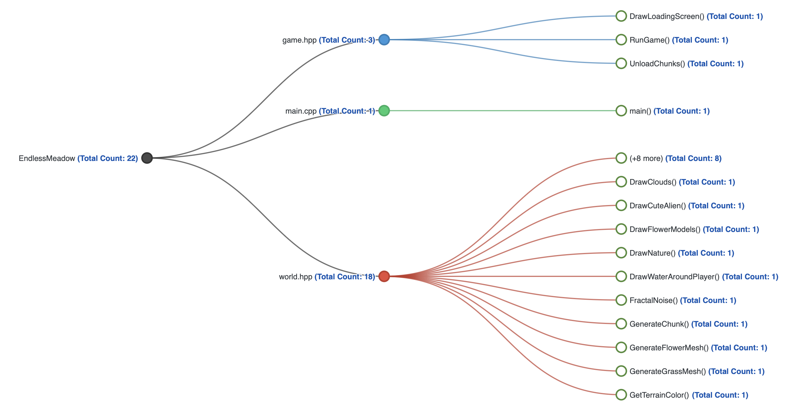

<p align="center">
  
</p>

<h1 align="center">Endless Meadow 🌿</h1>

<p align="center">
  A cinematic procedural meadow prototype and experimental mini-engine built in modern C++.
</p>

<p align="center">
  
  
  
  
</p>

<p align="center">
  
</p>

---


---

# Endless Meadow

Endless Meadow is a cinematic procedural world prototype powered by:

- modern C++
- raylib
- OpenGL
- procedural terrain synthesis
- real-time chunk streaming
- GPU-style vegetation rendering

The project focuses on creating a stylized infinite natural world with dynamic terrain generation, animated vegetation, atmospheric rendering and cinematic exploration systems.

---

# Architecture Graph



The project architecture is separated into:

- `main.cpp` → application entry point
- `game.hpp` → gameplay loop, rendering systems, camera logic, loading screen
- `world.hpp` → procedural terrain generation, environment systems and world rendering

---

# Features

- 🌱 Procedural grass rendering
- ⛰️ Infinite procedural terrain
- 🌊 Dynamic water rendering system
- ☁️ Atmospheric cloud rendering
- 🌲 Procedural trees and rocks
- 👾 Animated alien character
- 🎥 Cinematic free camera
- ⚡ Chunk streaming system
- ☀️ Dynamic environment rendering
- 🧠 Fractal noise terrain synthesis
- 🖥️ Modern C++ rendering architecture
- 🎮 Interactive preload screen
- 🧩 Runtime procedural mesh generation

---

# Engine Systems

The engine currently includes:

- procedural terrain synthesis
- chunk streaming system
- dynamic water rendering
- animated cloud rendering
- runtime environment generation
- animated character controller
- procedural flower spawning
- grass mesh generation
- terrain color blending
- cinematic preload pipeline
- atmospheric rendering systems

---

# Technologies

- C++
- raylib
- OpenGL
- GLSL
- CMake
- Procedural Generation
- Fractal Noise
- Runtime Mesh Generation
- Graphify
- Ollama

---

# Project Structure

```txt
EndlessMeadow/
├── assets/
│   ├── icons/
│   │   └── meadow.icns
│   │
│   ├── images/
│   │   ├── wallpaper.png
│   │   ├── meadoww.png
│   │   ├── endlessmeadow.png
│   │   ├── graphic.png
│   │   └── preload.png
│
├── build/
├── docs/
│   └── GRAPHIFY.md
│
├── include/
│   ├── game.hpp
│   └── world.hpp
│
├── src/
│   └── main.cpp
│
├── tools/
│   └── graphify/
│
├── .vscode/
├── CMakeLists.txt
├── README.md
└── LICENSE.md
```

---

# Rendering Pipeline

The rendering system uses:

* procedural mesh generation
* runtime terrain synthesis
* chunk-based world streaming
* layered terrain rendering
* dynamic environment rendering
* atmospheric color blending
* procedural vegetation placement

Terrain is generated using layered fractal noise functions combined with height shaping techniques to simulate stylized hills, valleys and natural landscapes.

---

# Terrain System

The terrain engine includes:

* infinite chunk streaming
* procedural heightmap generation
* runtime terrain loading
* terrain color interpolation
* biome-style environment variation
* procedural object spawning

Each chunk is generated independently and streamed dynamically around the player.

---

# Water System

The water rendering system includes:

* animated water movement
* dynamic wave simulation
* smooth water interpolation
* terrain-integrated water rendering
* atmospheric color blending

The water layer is rendered dynamically around the player position for seamless open-world integration.

---

# Environment System

The environment renderer currently supports:

* procedural tree placement
* procedural flowers
* animated clouds
* dynamic terrain coloring
* atmospheric sky rendering
* environment object scattering

---

# Character System

The alien controller includes:

* animated running cycle
* sprint animation
* jump movement
* falling animation states
* smooth camera following
* stylized procedural character rendering

---

# Architecture Workflow

The architecture graph is generated using:

* Graphify
* Ollama
* qwen2.5:7b

This allows automatic extraction of:

* file relationships
* rendering systems
* gameplay flow
* procedural generation systems
* engine architecture graphs

---

# Installation

## macOS

### Install dependencies

```bash
brew install raylib cmake
```

---

## Clone repository

```bash
git clone https://github.com/Armin-000/EndlessMeadow.git

cd EndlessMeadow
```

---

# Build

```bash
rm -rf build

cmake -S . -B build -DCMAKE_BUILD_TYPE=Release

cmake --build build
```

---

# Run

```bash
open build/EndlessMeadow.app
```

---

# Controls

| Key          | Action              |
| ------------ | ------------------- |
| W A S D      | Move                |
| Mouse        | Rotate Camera       |
| SHIFT        | Sprint              |
| SPACE        | Jump                |
| Double SPACE | Fly Mode            |
| ESC          | Unlock Mouse Cursor |

---

# Procedural Generation

The engine uses multiple procedural generation techniques:

* layered fractal noise
* terrain height shaping
* runtime chunk streaming
* procedural vegetation placement
* randomized environment variation
* terrain color synthesis

This allows the world to generate infinitely without storing large map data.

---

# Performance

The project includes:

* chunk visibility optimization
* runtime mesh generation
* lightweight rendering systems
* procedural asset generation
* optimized terrain synthesis
* distance-based environment rendering

---

# Project Purpose

This project was created as:

* a graphics programming experiment
* a procedural rendering showcase
* a terrain generation prototype
* a mini-engine architecture experiment
* a personal portfolio project

---

# Future Improvements

Planned upgrades include:

* volumetric clouds
* physically-based rendering (PBR)
* terrain erosion simulation
* biome generation
* dynamic weather system
* day/night transitions
* real-time shadows
* GPU instanced foliage
* post-processing effects
* cinematic camera tools
* ambient wildlife systems

---

# License

This project is intended for:

* learning
* experimentation
* graphics research
* portfolio demonstration

Commercial redistribution and resale are prohibited.

See `LICENSE.md` for additional information.