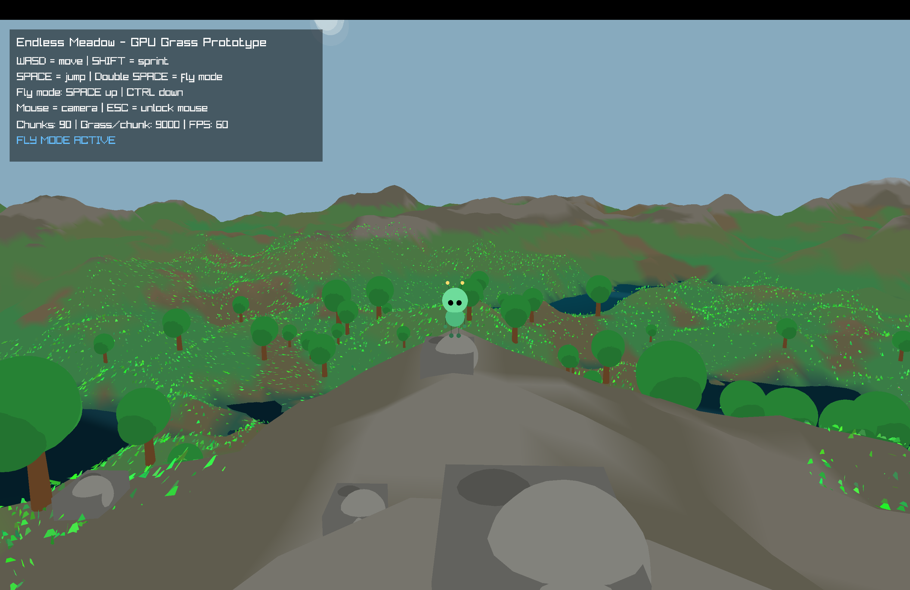

<p align="center">
  
</p>

<h1 align="center">Endless Meadow 🌿</h1>

<p align="center">
  Cinematic procedural meadow prototype built with modern C++ and raylib.
</p>

<p align="center">
  
  
  
  
</p>

---



---

# Features

- 🌱 Infinite procedural terrain
- 🌊 Animated water system
- ☁️ Atmospheric clouds
- 🌲 Procedural trees and rocks
- 🌸 GPU flower rendering
- 👾 Animated alien character
- 🎒 Backpack inventory system
- 🪵 Tree chopping & wood gathering
- 🗺️ Live terrain minimap
- ✨ Chunk streaming world
- 🛫 Fly mode
- 🎮 Cinematic exploration

---

# Controls

| Key | Action |
|------|--------|
| W A S D | Move |
| Mouse | Camera |
| SHIFT | Sprint |
| SPACE | Jump |
| Double SPACE | Fly Mode |
| CTRL | Fly Down |
| E | Backpack |
| M | Map |
| Left Click | Hit Tree |
| ESC | Pause |

---

# Project Structure

```txt
include/
├── game.hpp
├── world.hpp
├── world_types.hpp
├── terrain.hpp
├── vegetation.hpp
├── water.hpp
├── sky.hpp
├── alien.hpp
├── collisions.hpp
├── map.hpp
└── inventory.hpp

src/
├── main.cpp
├── world.cpp
├── terrain.cpp
├── vegetation.cpp
├── water.cpp
├── sky.cpp
├── alien.cpp
├── collisions.cpp
├── map.cpp
└── inventory.cpp
```

---

# Build

## macOS

Install dependencies:

```bash
brew install raylib cmake
```

Clone project:

```bash
git clone https://github.com/Armin-000/EndlessMeadow.git

cd EndlessMeadow
```

Build:

```bash
rm -rf build

cmake -S . -B build -DCMAKE_BUILD_TYPE=Release

cmake --build build
```

Run:

```bash
open build/EndlessMeadow.app
```

---

# Technologies

- C++17
- raylib
- OpenGL
- GLSL
- CMake
- Procedural Generation

---

# Current Systems

- Procedural terrain generation
- Runtime chunk streaming
- Grass & flower mesh generation
- Animated water shader
- Atmospheric sky rendering
- Alien animation system
- Tree collision system
- Tree destruction system
- Inventory UI system
- Real-time terrain map

---

# Future Plans

- Crafting system
- Day/night cycle
- Dynamic weather
- Wildlife
- Sound effects
- Biomes
- Better inventory system
- Survival mechanics

---

# License

This project is intended for:

- learning
- experimentation
- graphics programming
- portfolio showcase

See `LICENSE.md`.